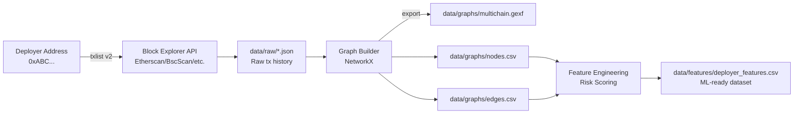

# **Multichain Scam Deployer Graph**


### *Cross-Chain Intelligence System for Mapping Malicious Deployer Behavior Across Ethereum, BSC, Arbitrum & Base*

---

## **Overview**

**Multichain Scam Deployer Graph** is an advanced on-chain intelligence toolkit designed to identify, analyze, and visualize malicious smart-contract deployers across multiple blockchains.
Using block-explorer API data, it builds a **full relationship graph** linking:

* **Deployer addresses**
* **Contracts they created**
* **Chains they operate on**
* **Graph-level metrics** (degree, centrality, expansion)
* **Risk-based features suitable for ML models**

This system enables deep blockchain forensics, including:

Detecting scammer clusters
Identifying deployers shared across chains
Quantifying deployer influence
Profiling contract factories and rugpull creators
Generating ML-ready datasets to detect high-risk deployers

The project outputs **NetworkX graphs**, **GEXF files**, **CSV edge + node tables**, and **a full feature matrix with risk scores**.

Designed for **security analysts, data scientists, threat researchers, and anti-scam detection teams**.

---

# **Project Structure**

```
multichain-scam-deployer-graph/
│
├── README.md                        # You are reading this
├── requirements.txt                 # Dependencies
│
├── data/
│   ├── raw/                         # Raw JSON from block explorers
│   ├── graphs/                      # Output graph files (.gexf, nodes.csv, edges.csv)
│   └── features/                    # ML-ready deployer features
│
└── src/
    ├── config.py                    # Chain configuration + API key handlers
    ├── explorers.py                 # Unified Etherscan V2 fetcher
    ├── graph_builder.py             # Graph construction + metrics
    ├── features.py                  # Feature engineering for ML
    ├── risk_rules.py                # Heuristic risk scoring
    ├── cli_fetch.py                 # CLI: fetch raw deployer history
    ├── cli_build_graph.py           # CLI: build graph + export
    └── cli_features.py              # CLI: compute deployer features
```

---

# **Installation**

Install dependencies:

```bash
pip install -r requirements.txt
```

Set **block-explorer API keys**:

### Windows (CMD)

```cmd
set ETHERSCAN_API_KEY=YOUR_KEY
set BSCSCAN_API_KEY=YOUR_KEY
set ARBISCAN_API_KEY=YOUR_KEY
set BASESCAN_API_KEY=YOUR_KEY
```

### macOS / Linux

```bash
export ETHERSCAN_API_KEY="YOUR_KEY"
export BSCSCAN_API_KEY="YOUR_KEY"
export ARBISCAN_API_KEY="YOUR_KEY"
export BASESCAN_API_KEY="YOUR_KEY"
```

---

# **1. Fetch Contract Deployment History**

Fetch the "normal" transactions for any deployer:

```bash
python -m src.cli_fetch --chain ethereum \
    --deployer 0xDEADBEEF... \
    --out data/raw/eth.json
```

This downloads:

* all transactions by the deployer
* filters ones that created contracts
* stores them as structured JSON

Example output:

```json
{
  "chain": "ethereum",
  "deployer": "0xDEADBEEF...",
  "txs": [ ... ]
}
```

Repeat for:

```
bsc
arbitrum
base
```

---

# **2. Build the Multi-Chain Graph**

Combine any number of raw JSON fetches:

```bash
python -m src.cli_build_graph \
  --inputs data/raw/*.json \
  --out_graph data/graphs/multichain.gexf \
  --out_nodes data/graphs/nodes.csv \
  --out_edges data/graphs/edges.csv
```

### This produces:

#### `multichain.gexf`

Graph for Gephi / Cytoscape visual analytics.

#### `nodes.csv`

Node-level attributes:

| column                 | meaning                          |
| ---------------------- | -------------------------------- |
| id                     | address                          |
| type                   | deployer / contract              |
| chain                  | ethereum / bsc / arbitrum / base |
| degree                 | how connected the node is        |
| in_degree              | # of edges pointing in           |
| out_degree             | # of edges pointing out          |
| betweenness_centrality | optional centrality measure      |

#### `edges.csv`

Edges between nodes:

| source   | target   | meaning                                       |
| -------- | -------- | --------------------------------------------- |
| deployer | contract | deployer → contract via DEPLOYED relationship |

---

# **3. Extract Features & Assign Risk Scores**

```bash
python -m src.cli_features \
  --nodes data/graphs/nodes.csv \
  --edges data/graphs/edges.csv \
  --out data/features/deployer_features.csv
```

### Output columns:

| Feature        | Description                              |
| -------------- | ---------------------------------------- |
| deployer       | Deployer address                         |
| n_contracts    | Contract count deployed                  |
| avg_out_degree | Graph expansion from deployer            |
| n_chains       | On how many chains this deployer appears |
| risk_score     | 0–100 heuristic risk                     |
| risk_level     | Low / Medium / High                      |
| risk_label     | ML-ready categorical label               |

Use this file for:

* clustering
* anomaly detection
* training ML models
* scam fingerprinting
* statistical analysis

---

# **How It Works (Architecture)**



---

# **Understanding the Output Graph**

The GEXF file represents the full deployer network:

* Deployer nodes are **squares**
* Contracts are **circles**
* Edges represent **DEPLOYED** relationships
* Degree indicates **activity level**
* Cross-chain deployers form **bridges** between subgraphs
* Clusters reveal scam families / contract factories

You can view this file using Gephi, which enables:

* Force Atlas 2 layout
* Degree-based sizing
* Chain-based coloring
* Risk-level overlays

---

# **Key Use Cases**

### Scam Detection

Identify deployers who create many unrelated contracts across multiple chains.

### Cross-Chain Intelligence

Track scammers migrating from ETH → BSC → Base.

### Wallet Reputation

Generate deployer risk profiles (Low / Medium / High).

### Token Factory Identification

Spot deployers with unusually high out-degree patterns.

### ML Model Training

Use the feature CSV to train a classifier that detects high-risk deployers.

### Forensic Investigation

Trace entire scam ecosystems from a single deployer.

---

# **Example: Signs of a High-Risk Deployer**

A deployer may be dangerous if:

* deploys 30+ contracts in short timeframe
* uses the same address across ETH/BSC
* creates mostly ERC-20 tokens with no verified source code
* deploys honeypots or high-tax tokens
* exhibits “clustered” behavior in graph space
* has high betweenness centrality (connects many scam subgraphs)

Your project reveals all of this automatically.

---

# **Technical Notes**

### NetworkX

Used for graph construction and metric computation.

### Etherscan V2

Your fetcher uses:

```
https://api.etherscan.io/v2/api
```

with `chainid` parameter.

### Graph Metrics

Provides:

* Degree
* In-degree
* Out-degree
* Betweenness (optional)

### CSV Exports

ML analysts can integrate directly into:

* pandas
* scikit-learn
* PyTorch Geometric
* Graph ML pipelines

---

# **Roadmap**

Planned enhancements:

* Multi-deployer batch scanning
* Automatic multi-chain merging
* Dynamic risk model (SciKit-Learn / XGBoost)
* Real-time Etherscan polling
* Scam cluster detection via graph embeddings (Node2Vec)
* PyVis interactive browser graph
* Solidity contract content analysis
* On-chain event analysis (Logs → graph edges)
